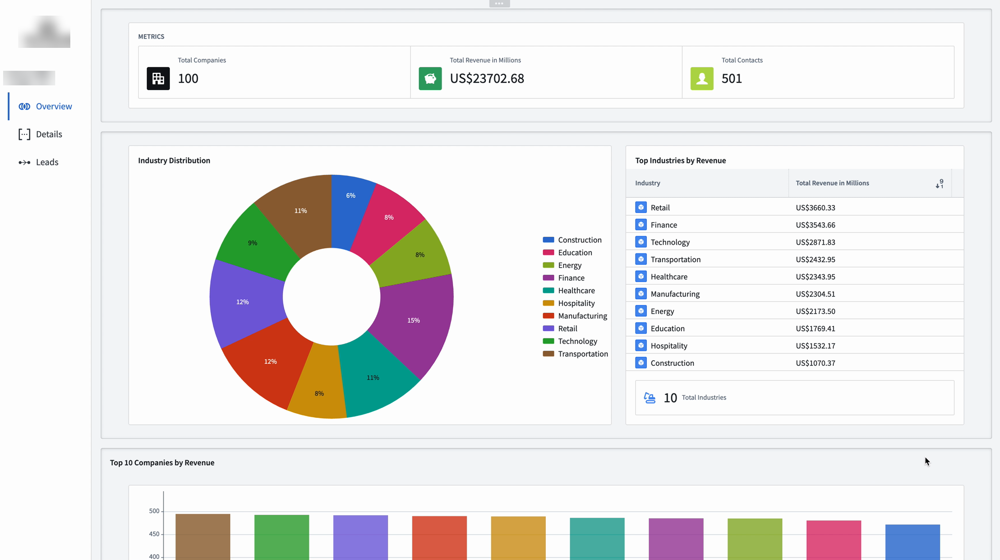
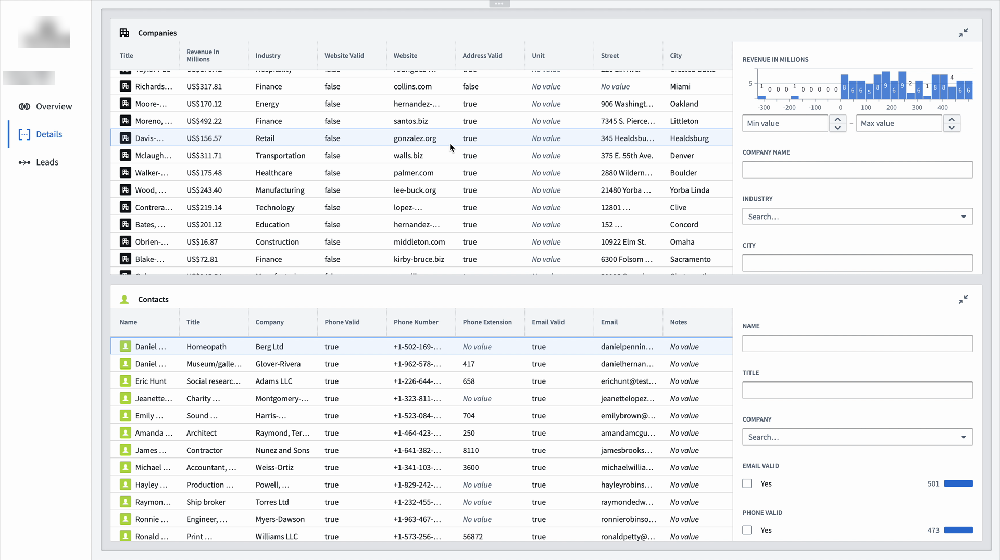
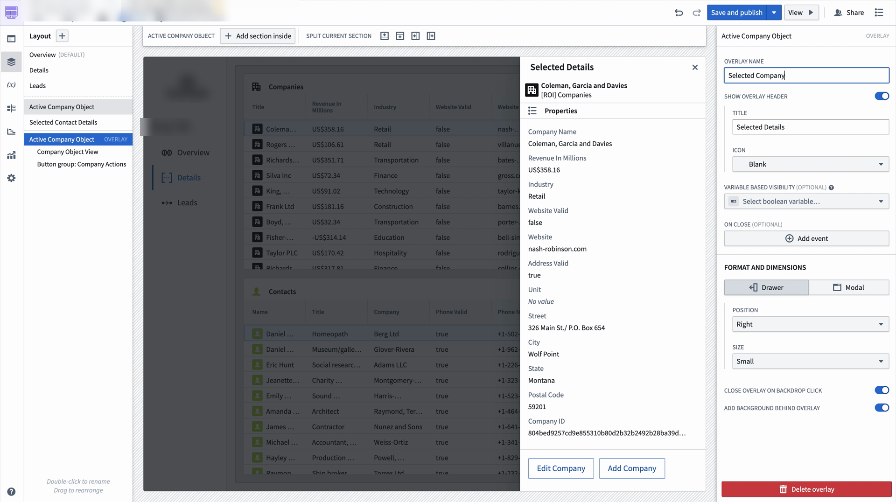
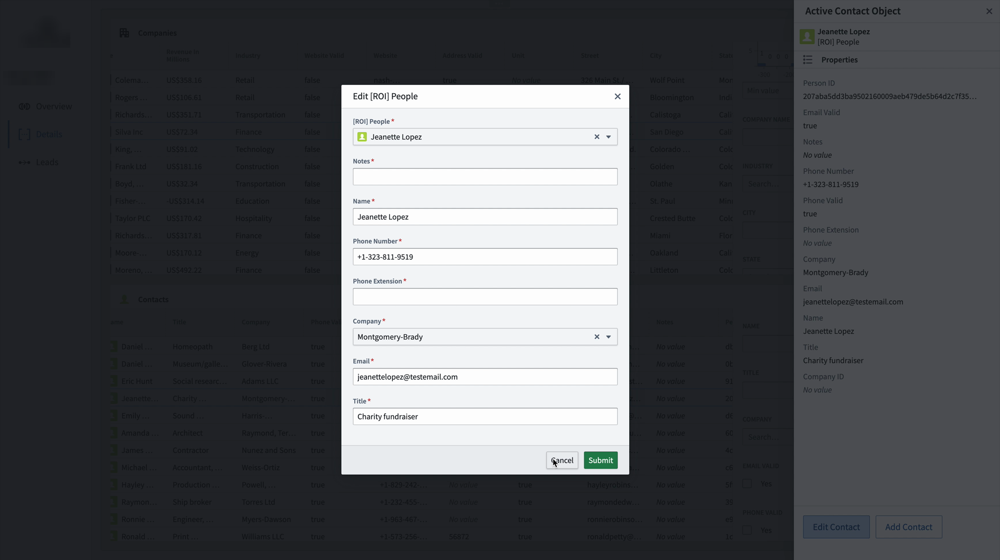
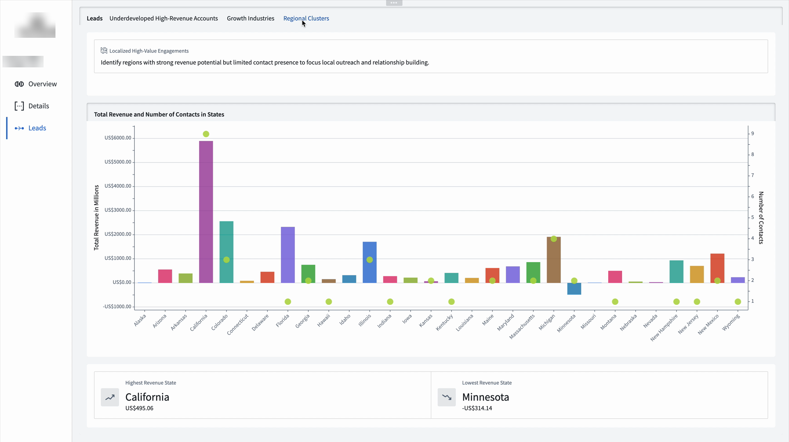

# Rangr CRM — Palantir Foundry Demo

## Overview

This repository showcases a CRM workflow I designed in **Palantir Foundry**. The project demonstrates how representative CRM data can be imported, cleaned, transformed, and structured into a usable customer relationship management interface.

The focus of this project was to move raw data through a practical preparation process and turn it into a business-facing workflow that supports customer management, account tracking, and lead analysis.

## Screenshots

The data shown in these screenshots is based on real-world CRM-style data but has been changed to protect the identities of people and companies involved. Company branding has been blurred for public sharing.

### CRM dashboard overview

### Data management views

### Foundry application builder and company detail drawer

### Contact workflow

### Lead analytics dashboard

## Project Purpose

This project was created to demonstrate my ability to work with structured business data and convert it into a usable CRM solution. It combines data preparation, transformation, workflow design, and business analysis thinking.

## Key Features

- Imported CRM-style source data into Palantir Foundry
- Cleaned and prepared raw data for CRM use
- Transformed data into structured, usable outputs
- Designed CRM views for companies, contacts, and lead analysis
- Built user-facing workflows for navigating and updating records
- Created analytics views to support business decision-making

## Tools and Technologies

- Palantir Foundry
- Data import pipelines
- Data cleaning and transformation workflows
- CRM workflow design
- Business analysis and data analysis principles

## Data Processing Workflow

1. **Data Import** — Source data was imported into Palantir Foundry.
2. **Data Cleaning** — The data was cleaned to improve consistency, accuracy, and usability.
3. **Data Transformation** — The cleaned data was transformed into structured CRM-ready outputs.
4. **CRM Design** — The transformed data was organised into CRM views and workflows.
5. **Lead Analysis** — Additional views were created to surface account and industry-level insights.

## Skills Demonstrated

- Business analysis
- Data analysis
- Data cleaning
- Data transformation
- CRM design
- Workflow design
- Palantir Foundry
- Translating source data into business-facing solutions

## Confidentiality Note

The data shown in this project is not raw client data. It is based on real-world CRM-style structures and has been altered to protect people, companies, and identifying details. The repository is intended to demonstrate the workflow, design approach, and technical process without exposing confidential information.
